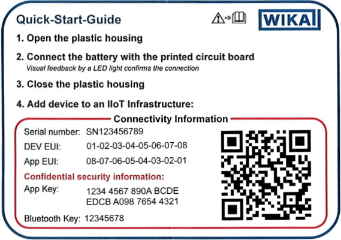

# Quick start guide

> DISCLAIMER: The TRU+NETRIS3 is currently not implemented for the new parsers (3.x.x+), but will follow this guide. The currently implemented NETRIS2 does not support changing the measuring range, therefore not fit to take as example in this guide.

This guide will help you get started with the JavaScript parser in a network server with Node-RED support.

1. You will need the Dev EUI, App EUI and App Key for your device. These can be found on the Quick Start Guide card that came with the device.
   - Device Extended Unique Identifier (Dev EUI) is a 16-character alphanumeric string.
   - Application Extended Unique Identifier (App EUI or JoinEUI) is a 16-character alphanumeric string.
   - Application Key (App Key) is an alphanumeric string of 32 characters. The App Key is a secret and should never be shared.\
   
2. You will need to know the measuring range of the device. The measuring ranges can be found on the model label of your sensor and in the sensor data sheet.
3. You have downloaded the correct parser for your device from the release section [here](https://github.com/WIKA-Group/javascript_parsers/releases). In this example we using TRU+NETRIS3.
4. Open the network server section of your gateway and navigate to the Device Registration page.
5. Register your device by entering your Dev EUI and App Key. The App Key is optional depending on the network server you used.
6. Open the Node-RED and create a new flow with
    - LoRa Input node,
    - Device Filter node,
    - Function node,
    - some Debug nodes.\
    
7. Set the Dev EUI on Device Filter node.
8. Open the index.js file and add the following lines at the bottom:

```javascript
// adjust the measuring range of channel 0 to -200 to 850
adjustMeasurementRange(0, {
  start: -200,
  end: 850
});

// function to convert base64 to the expected number array
function base64ToNumberArray(b: string) {
  const binaryString = atob(b)
  const len = binaryString.length
  const bytes = new Uint8Array(len)
  for (let i = 0; i < len; i++) {
    bytes[i] = binaryString.charCodeAt(i)
  }
  return Array.from(bytes)
}
// decode the payload
msg.payload = p.decodeUplink({
  bytes: base64ToNumberArray(msg.payload),
  fPort: 1,
})

msg.payload = decodeBase64String(msg.payload);

return msg;
```

The function you need to call depends on the network server you are using or the use case you have.
This example assumes the payload is in format Base64 and is thus first converted to hex string and then decoded.

9. Copy and Paste the content of the index.js file into the Function node.
10. Save and deploy your Node-RED flow.
11. Active your device.\
    
12. Done.
