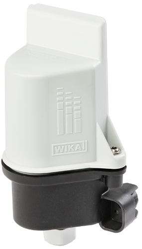

# Netris2

#### Description of the device

The model NETRIS®2 IIoT-capable WIKA radio unit is used wherever centralised, web-based, remote monitoring of measuring instrument data is required.
The Ex radio unit receives the data via the two intrinsically safe, analogue 4 ... 20 mA input signals. The fully encapsulated instrument with IP55 ingress protection transmits the received data continuously to a cloud via configurable data packets with LoRaWAN® (Long Range Wide Area Network).
Battery-operated wireless transmission via LoRaWAN® is based on LPWAN technology to enable high transmission ranges and long battery life.
The radio unit is connected to a suitable measuring instrument via cable.
The simple web configuration via the cloud and the LoRaWAN® network enables the complete end-to-end encryption with bidirectional communication for safe IIoT applications.
The WIKA radio unit NETRIS®2 is part of the WIKA IIoT solution. With this, WIKA offers a holistic solution for your digitalization strategy.

For more information see [product site](https://www.wika.com/en-en/netris_2.WIKA).
