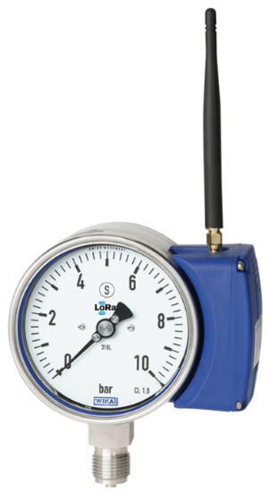

# PGW2x.100

#### Description of the device

Wherever the process pressure has to be indicated locally and, at the same time, centralised, web-based remote monitoring is required, this IIoT-capable measuring instrument finds its use.
The all welded and robust Bourdon tube measuring system produces a pointer rotation proportional to the pressure. The process pressure is indicated continuously by the pointer on the dial. The measuring electronics convert the pointer rotation into an electronic signal, which is further transmitted via the radio module and the antenna.
Battery-operated radio transmission via LoRa® („long range“) is based on LPWAN technology (“low power wide area network”) to enable high transmission ranges and long battery life.
The IIoT-capable model PGW2x.100 pressure gauge fulfils safety-related requirements of the relevant standards and regulations for the on-site display of the operating pressure of pressure vessels, as well as the requirements of the Radio Equipment Directive for data communication. In particular, the LoRaWAN® network (“long range wide area network”) enables the complete end-to-end encryption with bidirectional communication for safe IIoT applications.
WIKA manufactures and qualifies the pressure gauge in accordance with the requirements of the EN 837-1 European standard in the “S3” safety version. The safety version is made up of a non-splintering window, a solid baffle wall between measuring system and dial and a blow-out back.

---

For more information see [product site](https://www.wika.com/en-en/pgw23_100_pgw26_100.WIKA).
