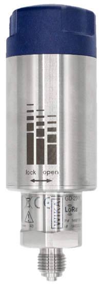

# GD20W

#### Description of the device

In order to prevent system failures in switchgear and network outages, the permanent monitoring of the gas density is essential.

The model GD-20-W calculates the current gas density from the pressure and temperature using a complex virial equation in the gas density sensor’s powerful microprocessor. Pressure changes resulting from temperature effects will be compensated by this and will not affect the output value.

---

For more information see [product site](https://www.wika.com/en-en/gd_20_w.WIKA).
