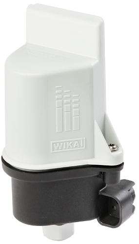

# Netris2



#### Description of the device

The model NETRIS®2 IIoT-capable WIKA radio unit is used wherever centralised, web-based, remote monitoring of measuring instrument data is required.
The Ex radio unit receives the data via the two intrinsically safe, analogue 4 ... 20 mA input signals. The fully encapsulated instrument with IP55 ingress protection transmits the received data continuously to a cloud via configurable data packets with LoRaWAN® (Long Range Wide Area Network).
Battery-operated wireless transmission via LoRaWAN® is based on LPWAN technology to enable high transmission ranges and long battery life.
The radio unit is connected to a suitable measuring instrument via cable.
The simple web configuration via the cloud and the LoRaWAN® network enables the complete end-to-end encryption with bidirectional communication for safe IIoT applications.
The WIKA radio unit NETRIS®2 is part of the WIKA IIoT solution. With this, WIKA offers a holistic solution for your digitalization strategy.

For more information see [product site](https://www.wika.com/en-en/netris_2.WIKA).

#### Usage of the parser

The NETRIS2 parser is used to decode the data from the NETRIS2 device and to encode data to be sent to the NETRIS2 device. It is intended to be used directly in LoRaWAN Network servers or on LoRaWAN Gateways. Therefor it conforms to the [LoRa Alliance Payload Codec API](https://resources.lora-alliance.org/technical-specifications/ts013-1-0-0-payload-codec-api).

The parser is written in way that it nevers `throws an error` and always returns a valid json object according to the schema json files.

Usage:
```javascript

// To decode an Uplink, add the following lines to your LoRaWAN Network server or Gateway:
const result = decodeUplink({
    bytes: [0x00, 0x01, 0x02, 0x03, /**       */], // Or your payload
    fPort: 1,
});

// If the payload is in Hex format, the parser also exposes a function to decode it:
const hexResult = decodeHexUplink({
    bytes: '0x00010203', // Or your payload
    fPort: 1,
});

// To encode a Downlink, add the following lines to your LoRaWAN Network server or Gateway:
const result = encodeDownlink({
    /** The options according to the downlink.schema.json */
});
```

The parser also exposes a function to change the amount of rounding decimals for the values in the payload. This is useful if you want to change the precision of the values in the payload. The default value is 4. You can change it by calling the function `adjustRoundingDecimals` before calling the `decodeUplink` or `decodeHexUplink` function:

```javascript
// To change the rounding decimals, add the following lines to your LoRaWAN Network server or Gateway:
adjustRoundingDecimals(2);

const result = decodeUplink({
    bytes: [0x00, 0x01, 0x02, 0x03, /**       */], // Or your payload
    fPort: 1,
});
```
