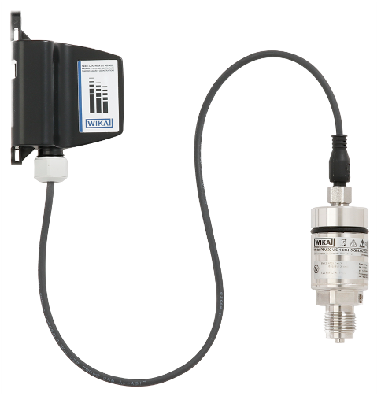

# PEU + Netris3

#### Description of the device

The model PEU-2x in combination with the WIKA model NETRIS®3 radio unit is used wherever web-based remote monitoring of the process pressure of liquids and gases is desired. Typical applications are mobile parts of plants or remote measuring locations. The connection to NETRIS®3 allows for cloud-based process and plant monitoring in industrial applications.

Via retrofit, machinery or moving parts can be smartly configured − without having to plan and document cable routing. Particularly when no continuous measurement is needed, cost advantages can be realised.

The pressure transmitter enables simple condition monitoring. A temperature indication inside the case, in addition to the pressure value, reveals possible malfunctions due to wear or system faults at an early stage and thus reduces the risk of downtime and damage.

The PEU-2x pressure transmitter is part of the WIKA IIoT solution. With this, WIKA offers a holistic solution for your digitalisation strategy.

---

For more information see [product site](https://www.wika.com/en-en/peu_20_peu_21.WIKA).
