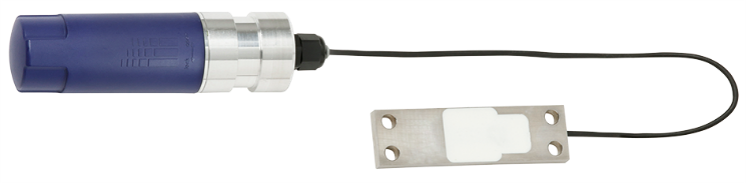

# F98W6

#### Description of the device

Strain transducers have been designed for applications in which there is a need to measure the deformation due to external forces acting on existing components. The transducer is simply screwed to the component. After the adjustment, the unit has the features of a force transducer.
The strain transducer is fastened with four screws to an area 
of the structure where the relevant strain occurs. Combined 
strain transducers can be connected directly to a junction box 
that contains an amplifier for system control.

---

For more information see [product site](https://www.wika.com/en-en/f9846.WIKA).