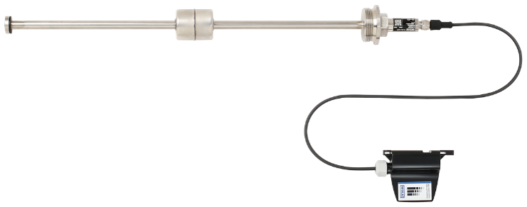

# FLRU + Netris3

#### Description of the device

The model FLRU level transmitter with reed-chain technology in combination with the WIKA model NETRIS®3 radio unit is used wherever web-based remote monitoring of level measurement in liquid media is desired. Condition-based and preventive maintenance through centralised big data analysis is thus possible.
Level transmitters of this model series work on the float principle with magnetic transmission and are used wherever centralised, web-based remote monitoring is required.The float's magnetic system in the guide tube actuates a resistance measuring chain that corresponds to a 3-wire potentiometer circuit. The measurement voltage generated by this is proportional to the fill level.
The measurement voltage is very finely stepped due to the contact separation of the measuring chain and is thus virtually continuous.Depending on the requirements, several different contact separations are available.
The FLRU reed level transmitter is part of the WIKA IIoT 
solution. With this, WIKA offers a holistic solution for your 
digitalisation strategy

---

For more information see [product site](https://www.wika.com/en-en/flru.WIKA?highlightedText=FLRU) or [datasheet](https://www.wika.com/media/Data-sheets/Level/Continuous-measurement-with-float/ds_lm2013_en_co.pdf).