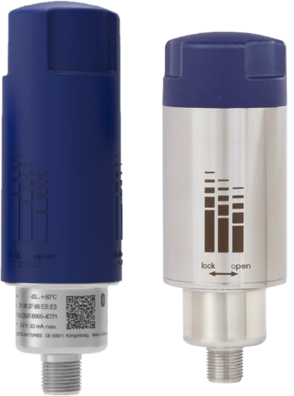

# Netris1

#### Description of the device

The model NETRIS®1 is a WIKA radio unit to which standard sensors can be connected in order to bring the measured data wirelessly to a cloud for big-data analysis. It uses the licence-free LoRaWAN® and Bluetooth® radio standards and is used, for example, on mobile equipment and remote measuring points. Thanks to intelligent measurement and transmission control and a replaceable battery, the radio unit can be operated over a long battery life.
The radio unit receives the data via connected measuring instruments with a standard signal of 0 ... 10 V or 4 ... 20 mA or an RTD in accordance with the Pt100/Pt1000 standard in 2- or 3-wire technology. The fully encapsulated instrument with IP65 ingress protection transmits the received data continuously to a cloud via configurable data packets with LoRaWAN® or Bluetooth®.
Wireless transmission via LoRaWAN® (“Long Range Wide Area Network”) is based on LPWAN technology (“Low Power Wide Area Network”) to enable high transmission ranges and long battery life. A version made of stainless steel is available or applications with harsh ambient conditions.
The instrument can be easily configured via the cloud and the LoRaWAN network or via the Bluetooth® interface.
Thanks to the compatibility with numerous WIKA measuring instruments and the two available radio standards, LoRaWAN® for the kilometre range, and Bluetooth® for the metre range, the radio unit can be flexibly configured. Configuration is possible both via the cloud and on-site using Bluetooth® and the “myWIKA wireless device” app.
The WIKA radio unit NETRIS®1 is part of the WIKA IIoT 
solution. With this, WIKA offers a holistic solution for your 
digitalisation strategy.

---

For more information see [product site](https://www.wika.com/en-en/netris1.WIKA).