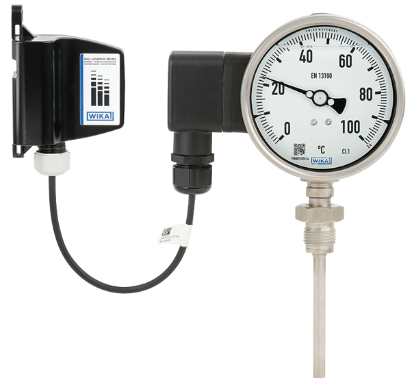

# TGU + Netris3

#### Description of the device

The model TGU73.100 thermometer in combination with the model NETRIS®3 radio unit is used wherever web-based remote monitoring of the process temperature is desired in addition to on-site indication. For the operation of TGU73.100 the use of a thermowell is necessary.
The model TGU73.100 combines a mechanical measuring system with electronic signal processing and is intended forthe connection to the WIKA radio unit model NETRIS®3.In this way, cloud-based process and plant monitoring can be realised in industrial applications.
This allows a condition-based and preventive maintenance through centralised big data analysis.Due to the wide variety of possible versions, the model TGU73.100 gas-actuated thermometer can be perfectly adapted to any process connection or location. With the adjustable stem and dial version, the case can be adjusted precisely to the desired viewing angle. With the contact bulb version (without direct contact with the medium), the temperature can be measured and monitored even when the pipe diameter is extremely small.
The WIKA measuring instrument TGU73.100 is part of the 
WIKA IIoT solution. With this, WIKA offers a holistic solution 
for your digitalisation strategy

---

For more information see [product site](https://www.wika.com/en-en/tgu73_100.WIKA).